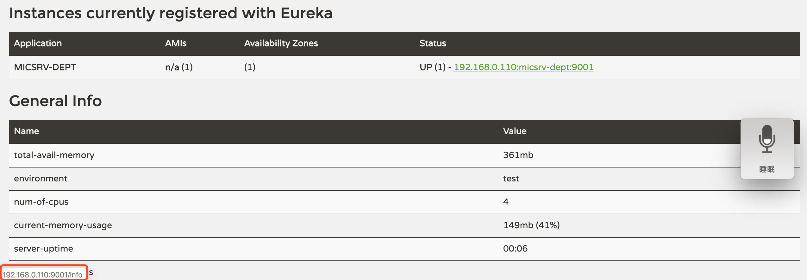
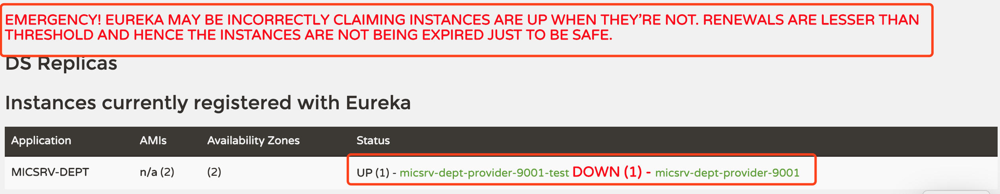
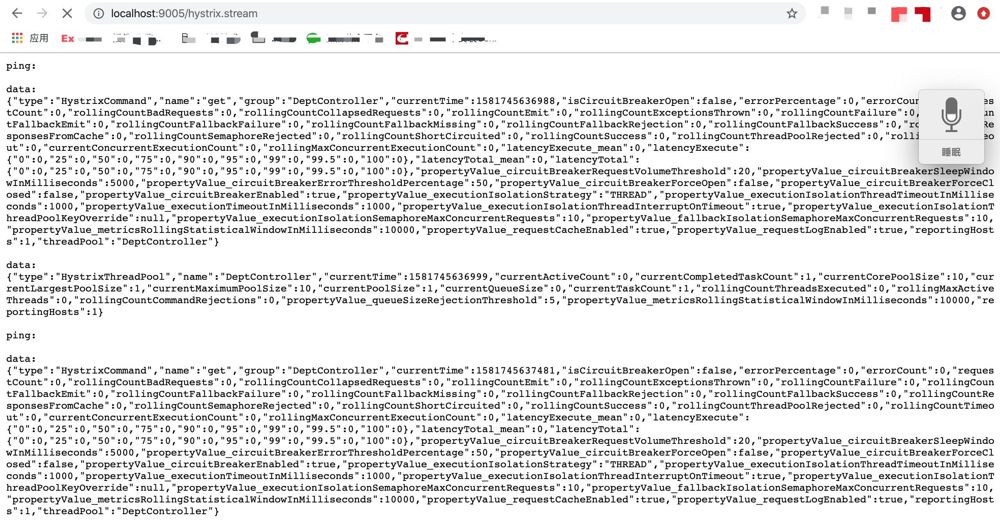

# Spring Cloud

## 一 带着常见面试问题学习

1、什么是微服务

2、SpringCloud和Dubbo的区别

3、SpringBoot和SpringCloud的理解

4、什么是服务熔断

5、什么是服务降级

6、微服务的优缺点及遇到的坑

7、eureka和zookeeper都可以提供服务注册和服务发现的功能，两者区别是什么？

## 二 微服务相关概述

###1、微服务架构

一般来说，微服务架构是一种架构模式，提倡将单一应用程序（all in one）划分成一组小的服务，每个服务运行在自己的进程中，提供单个业务功能的服务，服务之间采用轻量级的通信机制互相沟通（通常基于HTTP的RESTful API，而Dubbo是基于RPC）。

**推荐阅读**：[Martin Fowler - microservices](https://martinfowler.com/articles/microservices.html)

### 2、微服务

强调服务的大小，是一个个能够完成某一个具体的任务或者功能的服务应用。

狭义的说，可以看做是一个个工程或者使用springboot开发的module

### 3、微服务的优缺点

#### （1）优点

1. 每个服务足够小、足够内聚，代码容易理解，能够被小团队单独开发，开发效率高。

2. 微服务是松耦合的，每个微服务能够聚焦一个指定的业务功能或者业务需求。

3. 能够使用不同的语言开发某一个微服务。

4. 易于和第三方集成，融合最新的技术。

5. 微服务可以只关注业务逻辑代码，前后端分离开发模式下作为后端服务，无需关注css、html等技术的实现。
6. 每个微服务可以自由、灵活的搭配公共数据库或者独立的数据库。

#### （2）缺点

1. 多服务的运维和性能监控的难度增加。
2. 增加了系统部署之间的依赖。
3. 服务之间的通信成本增加。
4. 数据的一致性保证。

### 4、微服务技术栈

多种技术的集合体

服务开发、服务配置与管理、服务注册与发现、服务调用、负载均衡...

###5、选用SpringCloud作为微服务架构

#### （1）选型依据

整体解决方案和框架的成熟度

社区热度

可维护性

学习曲线

#### （2）当前各大IT公司用的微服务架构有哪些

阿里Dubbo/HSF、京东JSF、新浪微博Motan、当当网DubboX...

####（3）各微服务框架对比

| 功能点/服务框架 | Netflix/Spring Cloud                                         | Motan                                                        | gRPC                      | Thrift   | Dubbo/DubboX     |
| --------------- | ------------------------------------------------------------ | ------------------------------------------------------------ | ------------------------- | -------- | ---------------- |
| 功能定位        | 完整的微服务框架                                             | RPC框架，但整合了ZK或Consul，实现集群环境的基本的服务注册和发现 | RPC框架                   | RPC框架  | 服务框架         |
| 支持Rest        | 是，Ribbon支持多种可插拔的序列化选择                         | 否                                                           | 否                        | 否       | 否               |
| 支持RPC         | 否                                                           | 是                                                           | 是                        | 是       | 是               |
| 支持多语言      | 是                                                           | 否                                                           | 是                        | 是       | 否               |
| 服务注册与发现  | 是（Eureka服务注册表，Karyon服务端框架支持服务自注册和健康检查） | 是（zk/consul）                                              | 否                        | 否       | 是               |
| 负载均衡        | 是（服务端zuul动态路由+客户端Ribbon）                        | 是（客户端）                                                 | 否                        | 否       | 是（客户端）     |
| 配置服务        | Netflix Archaius Spring Cloud Server集中配置                 | 是（zk）                                                     | 否                        | 否       | 否               |
| 服务调用链监控  | 是（zuul，提供边缘服务，API网关）                            | 否                                                           | 否                        | 否       | 否               |
| 高可用/容错     | 是（服务端Hystrix+客户端Ribbon）                             | 是（客户端）                                                 | 否                        | 否       | 是（客户端）     |
| 典型应用案例    | Netflix                                                      | sina                                                         | google                    | facebook |                  |
| 社区活跃程度    | 高                                                           | 一般                                                         | 高                        | 一般     | 2017年重启维护   |
| 学习难度        | 中等                                                         | 低                                                           | 高                        | 高       | 低               |
| 文档丰富度      | 高                                                           | 一般                                                         | 一般                      | 一般     | 高               |
| 其他            | Spring Cloud Bus为我们的应用程序带来了更多管理端点           | 支持降级                                                     | Netflix内部在开发集成gRPC | IDL定义  | 支持的公司比较多 |

## 三 SpringCloud入门

### 1、 什么是SpringCloud

SpringCloud，基于SpringBoot提供了一整套微服务解决方案，包括服务注册与发现、配置中心、全链路监控、服务网关、负载均衡、熔断器等组件，除了基于Netflix的开源组件做高度抽象封装之外，还有一些选型中立的开源组件。

SpringCloud利用SpringBoot的开发便利性巧妙地简化了分布式系统基础设施的开发，SpringCloud为开发人员提供了快速构建分布式系统的一些工具，包括配置管理、服务发现、断路器、路由、微代理、事件总线、全局锁、决策竞选、分布式会话等等，他们都可以利用SpringBoot的开发风格做到一键启动和部署。

SpringBoot只是将目前各家公司开发的比较成熟、经得起实际考验的服务框架组合起来，通过SpringBoot峰峰进行再封装屏蔽掉了复杂的配置和实现原理，最终给发if阿哲留出了一套简单易懂、易部署和易维护的分布式系统开发工具包。

**SpringCloud = 分布式微服务架构下的一站式解决方案，是各个微服务架构落地技术的集合体，俗称微服务全家桶**

###2、SpringCloud和SpringBoot的关系

SpringBoot：专注于快速便捷的开发单个个体微服务。

SpringCloud：专注全局的微服务协调整理治理框架，将SpringBoot开发的一个个单体微服务整合并管理起来，为各个微服务之间提供配置管理、服务发现、断路器等等集成服务。

SpringBoot可以单独开发并发布，不依赖于SpringCloud，但是SpringCloud依赖于SpringBoot。

**SpringBoot专注于快速、方便的开发单个微服务个体，SpringCloud关注全局的服务治理框架**

### 3、SpringCloud和Dubbo的关系

目前成熟的互联网架构：分布式+服务治理Dubbo

####（1）活跃度

Dubbo：https://github.com/dubbo

SpringCloud：https://github.com/spring-cloud

#### （2）对比

| 功能         | dubbo               | springCLoud                 |
| ------------ | ------------------- | --------------------------- |
| 服务注册中心 | 没有，使用zookeeper | SpringCloud Netflix Eureka  |
| 服务调用方式 | RPC                 | REST API                    |
| 服务监控     | Dubbo-monitor       | Spring Boot Admin           |
| 断路器       | 不完善              | SpringCloud Netflix Hystrix |
| 服务网关     | 无                  | SpringCloud Netflix Zuul    |
| 分布式配置   | 无                  | SpringCloud Config          |
| 服务跟踪     | 无                  | SpringCloud Sleuth          |
| 消息总线     | 无                  | SpringCloud Bus             |
| 数据流       | 无                  | SpringCloud Stream          |
| 批量任务     | 无                  | SpringCloud Task            |
| ......       | ......              | ......                      |

#### （3）区别

SpringCloud采用基于HTTP的REST方式，摒弃了Dubbo的RPC通信。

两种方式各有优劣，SpringCloud牺牲了服务调用的性能，但也避免了原生RPC带来的问题，而且REST比RPC更为灵活，服务提供方和调用方的依赖只依靠一纸契约，不存在代码级别的强依赖，这在强调快速演化的微服务环境下，显得更加合适。

#### （4）总结

阿里高级研发工程师刘军给出二者定位：Dubbo和Spring Cloud并不是完全的竞争关系，Dubbo的定位始终是一款RPC框架，Spring Cloud的目标是微服务架构下的一站式解决方案。Dubbo可以类比到Netflix OSS技术栈，而Spring Cloud是集成了Netflix OSS作为分布式服务治理解决方案。

之所以二者经常被拿来比较，是由于RPC协议、注册中心元数据不匹配等问题，在面临微服务基础框架选型时Dubbo与Spring Cloud只能二选一。

Dubbo未来会积极寻求适配到Spring Cloud生态，比如作为Spring Cloud的二进制通信方案来发挥Dubbo的性能优势，或者通过模块化以及对http的支持适配到Spring Cloud。

###4、SpringCloud资料

####（1）命名

Spring Cloud版本号以英国伦敦地铁站名命名

#### （2）资料

[SpringCloud官网](https://spring.io/projects/spring-cloud)

[SpringCloud中文网](https://www.springcloud.cc/)

[SpringCloud API中文](https://www.springcloud.cc/spring-cloud-dalston.html)

[SpringCloud中文社区](http://springcloud.cn/)

### 5、REST微服务构建案例工程模块

####1、总体设计

基于springmvc+mybatis+mysql，以Dept部门模块做一个微服务通用案例。

Consumer消费者（client）通过REST调用Provider提供者（server）提供的服务。

Maven分包分模块架构，一个project带着多个module子模块

#### 2、版本使用

**Spring Cloud：Dalston.SR1**

**Spring Boot：1.5.9.RELEASE**

####3、构建步骤

#### （1）整体父工程

* 创建maven project

**注意：micsrv_cloud_parent的packaging是pom模式**

主要是定义pom文件，将后续各个子模块公用的jar包等统一提出来，类似一个抽象父类。

#### （2）公共子模块

* 创建maven module

* 生成jar包在target目录下

run as --> maven clean

run as --> maven install 

#### （3）部门微服务提供者模块

约定 > 配置 > 编码

* 如第二步，创建maven module

* 配置pom文件

~~~xml
<project xmlns="http://maven.apache.org/POM/4.0.0"
	xmlns:xsi="http://www.w3.org/2001/XMLSchema-instance"
	xsi:schemaLocation="http://maven.apache.org/POM/4.0.0 http://maven.apache.org/xsd/maven-4.0.0.xsd">
	<modelVersion>4.0.0</modelVersion>
	<parent>
		<groupId>com.lovestory.sc_demo</groupId>
		<artifactId>microsrv_parent</artifactId>
		<version>0.0.1-SNAPSHOT</version>
	</parent>
	<artifactId>micsrv_dept_provider</artifactId>
	<dependencies>
		<!-- 引入自己定义的common_sub通用包，可以使用Dept部门的entity -->
		<dependency>
			<groupId>com.lovestory.sc_demo</groupId>
			<artifactId>microsrv_common_sub</artifactId>
			<version>${project.version}</version>
		</dependency>
		<dependency>
			<groupId>junit</groupId>
			<artifactId>junit</artifactId>
		</dependency>
		<dependency>
			<groupId>mysql</groupId>
			<artifactId>mysql-connector-java</artifactId>
		</dependency>
		<dependency>
				<groupId>com.alibaba</groupId>
				<artifactId>druid</artifactId>
			</dependency>
			<dependency>
				<groupId>org.mybatis.spring.boot</groupId>
				<artifactId>mybatis-spring-boot-starter</artifactId>
			</dependency>
			<dependency>
				<groupId>org.springframework.boot</groupId>
				<artifactId>spring-boot-starter-jetty</artifactId>
			</dependency>
			<dependency>
				<groupId>org.springframework.boot</groupId>
				<artifactId>spring-boot-starter-web</artifactId>
			</dependency>
			<dependency>
				<groupId>org.springframework.boot</groupId>
				<artifactId>spring-boot-starter-test</artifactId>
			</dependency>
			<dependency>
				<groupId>ch.qos.logback</groupId>
				<artifactId>logback-core</artifactId>
			</dependency>
			<!-- 热部署，修改后立即生效 -->
			<dependency>
				<groupId>org.springframework</groupId>
				<artifactId>springloaded</artifactId>
			</dependency>
			<dependency>
				<groupId>org.springframework.boot</groupId>
				<artifactId>spring-boot-devtools</artifactId>
			</dependency>
	</dependencies>
</project>
~~~

* 配置YML文件，resource目录下创建并配置application.yml

~~~yaml
# springmvc+springboot+mybatis整合案例
server:
	port: 9001

# mybatis整合	
mybatis:
	config-location: classpath:mybatis/mybatis.cfg.xml  # mybatis配置文件所在路径
	type-aliases-package: com.lovestory.sc_demo.entities  # 所有Entity别名类所在包
	mapper-locations:
	- classpath:mybatis/mapper/**/**.xml  # mapper映射文件，xxxMapper配置文件存放路径
	
	# 原来的DAO实现是
	# DeptDAO --- DeptDAOImpl
	
	# mybatis在DAO层有两种解析方式
	# 1、xxxMapper.xml配置方式
	# DeptDAO --- DeptMapper.xml
	
	# 2、注解方式

# spring整合
spring:
	application:
	 name: micsrv-dept  # 对外暴露的微服务名字
	datasource:
	 type: com.alibaba.druid.pool.DruidDataSource  # 当前数据源操作类型
	 driver-class-name: org.gjt.mm.mysql.driver		# mysql驱动包
	 url: jdbc:mysql://localhost:3306/sc_db01	# 数据库名称
	 username: root
	 password: root
	 dbcp2:
		min-idle: 5  # 数据库连接池的最小维持连接数
		initial-size: 5  # 初始化连接数
		max-total: 5		# 最大连接数
		max-wait-millis: 200 # 等待连接获取的最大超时时间
~~~

* 创建并配置mybatis/mybatis.cfg.xml

~~~xml
<?xml version="1.0" encoding="UTF-8" ?>
<!DOCTYPE configuration PUBLIC "-//mybatis.org//DTD Config 3.0//EN" "http://mybatis.org/dtd/mybatis-3-config.dtd">

<configuration>
	<settings>
		<!-- 开启二级缓存 -->
		<setting name="cacheEnabled" value="true" />
	</settings>
</configuration>
~~~

* mysql创建部门数据库脚本

~~~sql
DROP DATABASE IF EXISTS sc_db01;

CREATE DATABASE sc_db01 CHARACTER SET UTF8;

USE sc_db01;

CREATE TABLE dept
(
	deptno BIGINT NOT NULL PRIMARY KEY AUTO_INCREMENT,
  dname VARCHAR(60),
	db_source VARCHAR(60)
);

-- DATABASE() mysql自带函数 表示当前所在库的库名
INSERT INTO dept(dname, db_source) VALUES('开发部', DATABASE());
INSERT INTO dept(dname, db_source) VALUES('人事部', DATABASE());
INSERT INTO dept(dname, db_source) VALUES('财务部', DATABASE());
INSERT INTO dept(dname, db_source) VALUES('市场部', DATABASE());
INSERT INTO dept(dname, db_source) VALUES('运维部', DATABASE());

SELECT deptno,dname,db_source FROM dept WHERE deptno=#{deptno};
~~~

* 创建部门接口Dao类

~~~java
package com.lovestory.sc_demo.dao;

import java.util.List;

import org.apache.ibatis.annotations.Mapper;

import com.lovestory.springcloud.entities.Dept;

// 关键：springboot整合mybatis需要添加注解 @Mapper -- 重要！！！
@Mapper
public interface DeptDao {
	public boolean addDept(Dept dept);

	public Dept findById(Long id);

	public List<Dept> findAll();
}

~~~

* resource/mybatis/mapper/目录下创建配置DeptMapper.xml

~~~xml
<?xml version="1.0" encoding="UTF-8" ?>
<!DOCTYPE mapper 
PUBLIC "-//mybatis.org//DTD Mapper 3.0//EN" 
"http://mybatis.org/dtd/mybatis-3-mapper.dtd">

<mapper namespace="com.lovestory.sc_demo.dao.DeptDao">
	<select id="findById" resultType="Dept" parameterType="Long">
		SELECT deptno,dname,db_source 
		FROM dept 
		WHERE deptno=#{deptno};
	</select>
	<select id="findAll" resultType="Dept">
		SELECT deptno,dname,db_source
		FROM dept;
	</select>
	<insert id="addDept" parameterType="Dept">
		INSERT INTO dept(dname,db_source) VALUES(#{dname},DATABASE());
	</insert>
</mapper>
~~~

* 创建DeptService服务接口

~~~java
package com.lovestory.sc_demo.service;

import java.util.List;

import com.lovestory.springcloud.entities.Dept;

public interface DeptService {
	public boolean add(Dept dept);

	public Dept get(Long id);

	public List<Dept> list();
}

~~~

* 创建DeptServiceImpl服务实现类

~~~java
package com.lovestory.sc_demo.service.impl;

import java.util.List;

import org.springframework.beans.factory.annotation.Autowired;
import org.springframework.stereotype.Service;

import com.lovestory.sc_demo.dao.DeptDao;
import com.lovestory.sc_demo.service.DeptService;
import com.lovestory.springcloud.entities.Dept;

@Service
public class DeptServiceImpl implements DeptService {

	// service层使用add、get、list，而不用dao层的addDept、fingById和findAll
	// 是为了尽量符合Rest风格，与controller层贴近
	
	@Autowired
	private DeptDao dao;

	@Override
	public boolean add(Dept dept) {
		return dao.addDept(dept);
	}

	@Override
	public Dept get(Long id) {
		return dao.findById(id);
	}

	@Override
	public List<Dept> list() {
		return dao.findAll();
	}

}

~~~

* 创建DeptController接口

~~~java
package com.lovestory.sc_demo.controller;

import java.util.List;

import org.springframework.beans.factory.annotation.Autowired;
import org.springframework.web.bind.annotation.PathVariable;
import org.springframework.web.bind.annotation.RequestBody;
import org.springframework.web.bind.annotation.RequestMapping;
import org.springframework.web.bind.annotation.RequestMethod;
import org.springframework.web.bind.annotation.RestController;

import com.lovestory.sc_demo.service.DeptService;
import com.lovestory.springcloud.entities.Dept;

@RestController
public class DeptController {

	@Autowired
	private DeptService service;

	@RequestMapping(value = "/dept/add", method = RequestMethod.POST)
	public boolean add(@RequestBody Dept dept) {
		return service.add(dept);
	}

	@RequestMapping(value = "/dept/get/{id}", method = RequestMethod.GET)
	public Dept get(@PathVariable("id") Long id) {
		return service.get(id);
	}

	@RequestMapping(value = "/dept/list", method = RequestMethod.GET)
	public List<Dept> list() {
		return service.list();
	}
}
~~~

* 启动类App

~~~java
package com.lovestory.sc_demo;

import org.springframework.boot.SpringApplication;
import org.springframework.boot.autoconfigure.SpringBootApplication;

@SpringBootApplication
public class DeptProvider9001App {

	public static void main(String[] args) {
		SpringApplication.run(DeptProvider9001App.class, args);
	}

}

~~~

* 测试

####（4）部门为服务消费者模块

* 如第二步，创建maven module

* 配置pom.xml

~~~xml
<project xmlns="http://maven.apache.org/POM/4.0.0"
	xmlns:xsi="http://www.w3.org/2001/XMLSchema-instance"
	xsi:schemaLocation="http://maven.apache.org/POM/4.0.0 http://maven.apache.org/xsd/maven-4.0.0.xsd">
	<modelVersion>4.0.0</modelVersion>
	<parent>
		<groupId>com.lovestory.sc_demo</groupId>
		<artifactId>microsrv_parent</artifactId>
		<version>0.0.1-SNAPSHOT</version>
	</parent>

	<artifactId>micsrv_dept_consumer</artifactId>
	<description>部门微服务消费者</description>

	<dependencies>
		<!-- 引入自己定义的common_sub通用包，可以使用Dept部门的entity -->
		<dependency>
			<groupId>com.lovestory.sc_demo</groupId>
			<artifactId>microsrv_common_sub</artifactId>
			<version>${project.version}</version>
		</dependency>
		<dependency>
			<groupId>org.springframework.boot</groupId>
			<artifactId>spring-boot-starter-web</artifactId>
		</dependency>
		<!-- 热部署，修改后立即生效 -->
		<dependency>
			<groupId>org.springframework</groupId>
			<artifactId>springloaded</artifactId>
		</dependency>
		<dependency>
			<groupId>org.springframework.boot</groupId>
			<artifactId>spring-boot-devtools</artifactId>
		</dependency>
	</dependencies>
</project>
~~~

* 创建并配置yml文件

~~~yml
server:
  port: 80
~~~

* ConfigBean的编写

类似Spring中applicationContext.xml写入的bean

~~~java
package com.lovestory.sc_demo.cfgbeans;

import org.springframework.context.annotation.Bean;
import org.springframework.context.annotation.Configuration;
import org.springframework.web.client.RestTemplate;

// @Configuration 注解使得该类变成了配置类
@Configuration
public class ConfigBean { // @Configuration ConfigBean 等同于 applicationContext.xml

	// <bean id="restTemplate" class="org.springframework.web.client.RestTemplate">
	@Bean
	public RestTemplate getRestTemplate() {
		return new RestTemplate();
	}
}
~~~

* 创建消费者REST

无需service层

> RestTemplate简介

RestTemplate与JDBCTemplate、RedisTemplate类似。

它提供了多种便捷访问远程Http服务的方法。

是一种简单便捷的访问restful服务模板类，是Spring提供的用于访问Rest服务的**客户端模板工具集**。

> RestTemplate使用入门

(Url, requestMap, ResponseBean.class) 参数分别代表 REST请求地址、请求参数、HTTP响应转换被转换成的对象类型。

~~~java
package com.lovestory.sc_demo.controller;

import java.util.List;

import org.springframework.beans.factory.annotation.Autowired;
import org.springframework.web.bind.annotation.PathVariable;
import org.springframework.web.bind.annotation.RequestMapping;
import org.springframework.web.bind.annotation.RestController;
import org.springframework.web.client.RestTemplate;

import com.lovestory.springcloud.entities.Dept;

@RestController
public class DeptControllerConsumer {

	private static final String REST_URL_PREFIX = "http://localhost:9001";

	@Autowired
	private RestTemplate restTemplate;

	@RequestMapping(value = "/consumer/dept/add")
	public boolean add(Dept dept) {
		String url = REST_URL_PREFIX + "/dept/add";
		return restTemplate.postForObject(url, dept, Boolean.class);
	}

	@RequestMapping(value = "/consumer/dept/get/{id}")
	public Dept get(@PathVariable("id") Long id) {
		String url = REST_URL_PREFIX + "/dept/get/" + id;
		return restTemplate.getForObject(url, Dept.class);
	}

	@SuppressWarnings("unchecked")
	@RequestMapping(value = "/consumer/dept/list")
	public List<Dept> list() {
		String url = REST_URL_PREFIX + "/dept/list";
		return restTemplate.getForObject(url, List.class);
	}
}
~~~

* 测试

####4、总结

微服务化的核心就是将传统的一站式应用，根据业务拆分成一个个的服务，彻底去耦合，每个微服务提供单个业务功能的服务，一个服务做一件事。

从技术角度看，就是一种小而独立的处理过程，类似进程概念，能够自行单独启动或销毁，拥有自己独立的数据库。

## 四 Eureka服务注册与发现

### 1、什么是Eureka

网址：[eureka-github](https://github.com/Netflix/eureka)

Netflix在设计Eureka的时候，遵守的是AP原则。

Eureka是Netflix的一个子模块，也是核心模块之一。

Eureka是一个基于REST的服务，用于定位服务，以实现云端中间层服务发现和故障转移。

服务发现与注册，只需要使用服务标识符，就可以访问到服务，而不需要修改服务调用的配置文件。功能类似于dubbo的注册中心，比如zookeeper。

### 2、Eureka基本原理

> Eureka

Eureka模块用来实现服务注册和发现。

采用C-S设计架构。

Eureka Server作为服务注册功能的服务器，是服务注册中心。

系统中的其他服务使用Eureka的客户端连接到Eureka Server并维持心跳连接，便于通过Eureka Server监控系统中各微服务运行状况。

例如，zuul就是通过Eureka Server来发现系统中其他微服务的。

> dubbo

### 3、Eureka组件

####（1）Eureka Server

提供服务注册服务

各节点启动后，会在Eureka Server中进行注册，Eureka Server中的服务注册表会存储所有可用服务节点的信息，服务节点的信息可以在界面中直观的看到。

####（2）Eureka Client

一个java客户端，简化Eureka Server的交互。

具备一个内置的、使用轮询负载算法的负载均衡器。

应用启动后，会向Eureka Server发送心跳（默认周期30秒），Eureka Server若在多个心跳周期内没有接收到节点心跳，Eureka Server将会从服务注册表中删除该服务节点（默认90秒）。

### 4、三大角色

Eureka Server：提供服务注册和发现。

Service Provider：服务提供方，将自身服务注册到Eureka，从而使服务消费方能够找到。

Service Consumer：服务消费方，从Eureka获取注册服务列表，从而能够消费服务。

### 5、构建

#### （1）创建服务注册中心模块

* 创建module

* 配置pom.xml

~~~xml
<project xmlns="http://maven.apache.org/POM/4.0.0"
	xmlns:xsi="http://www.w3.org/2001/XMLSchema-instance"
	xsi:schemaLocation="http://maven.apache.org/POM/4.0.0 http://maven.apache.org/xsd/maven-4.0.0.xsd">
	<modelVersion>4.0.0</modelVersion>
	<parent>
		<groupId>com.lovestory.sc_demo</groupId>
		<artifactId>microsrv_parent</artifactId>
		<version>0.0.1-SNAPSHOT</version>
	</parent>

	<artifactId>microsrv_eureka_9000</artifactId>

	<dependencies>
		<!-- eureka server 服务端 -->
		<dependency>
			<groupId>org.springframework.cloud</groupId>
			<artifactId>spring-cloud-starter-eureka-server</artifactId>
		</dependency>
		<!-- 热部署，立即生效 -->
		<dependency>
			<groupId>org.springframework</groupId>
			<artifactId>springloaded</artifactId>
		</dependency>
		<dependency>
			<groupId>org.springframework.boot</groupId>
			<artifactId>spring-boot-devtools</artifactId>
		</dependency>
	</dependencies>
</project>
~~~

* 配置application.xml

~~~xml
eureka: 
  client: 
    fetch-registry: false  # false表示自己就是注册中心，职责就是维护服务实例，并不需要去检索服务
    register-with-eureka: false  # false表示不向注册中心注册自己，表示自己不是微服务提供方
    service-url: 
      defaultZone: "http://${eureka.instance.hostname}:${server.port}/eureka/"  # 设置与Eureka Server交互的地址查询服务和注册服务
  instance: 
    hostname: localhost  # eureka服务端实例名称
server: 
  port: 9000
~~~

* Eureka Server主启动类

@@EnableEurekaServer注解：表示Eureka Server服务器端启动类，接受其他微服务注册进来

~~~java
package com.lovestory.sc_demo;

import org.springframework.boot.SpringApplication;
import org.springframework.boot.autoconfigure.SpringBootApplication;
import org.springframework.cloud.netflix.eureka.server.EnableEurekaServer;

@SpringBootApplication
@EnableEurekaServer
public class EurekaServerApp {

	public static void main(String[] args) {
		SpringApplication.run(EurekaServerApp.class, args);

	}
}
~~~

* 测试

#### （2）将已有服务提供方注册进Eureka

修改micsrv_dept_provider模块

* 修改pom.xml

~~~xml
<!-- 添加 -->
<!-- 将微服务provider注册进Eureka -->
<dependency>
	<groupId>org.springframework.cloud</groupId>
  <artifactId>spring-cloud-starter-eureka</artifactId>
</dependency>
<dependency>
	<groupId>org.springframework.cloud</groupId>
  <artifactId>spring-cloud-starter-config</artifactId>
</dependency>

~~~

* 修改yaml文件

~~~yaml
# 添加
eureka: 
  client:  # 客户端注册进Eureka服务列表内
    service-url: 
      defaultZone: "http://localhost:9000/eureka"
~~~

* 修改主启动类

@EnableEurekaClient注解：表示本服务启动后会自动注册进Eureka服务中。

~~~java
package com.lovestory.sc_demo;

import org.springframework.boot.SpringApplication;
import org.springframework.boot.autoconfigure.SpringBootApplication;
import org.springframework.cloud.netflix.eureka.EnableEurekaClient;

@SpringBootApplication
@EnableEurekaClient
public class DeptProvider9001App {

	public static void main(String[] args) {
		SpringApplication.run(DeptProvider9001App.class, args);
	}
}
~~~

* 测试

####（3）actuator与注册微服务信息完善

* 修改主机映射名称

~~~yaml
eureka: 
  client:  # 客户端注册进Eureka服务列表内
    service-url: 
      defaultZone: "http://localhost:9000/eureka"
    # 添加
  instance:
    instance-id: micsrv-dept-provider-9001
~~~

原名称：

修改后：

* 修改主机ip信息提示

~~~yaml
eureka: 
  client:  # 客户端注册进Eureka服务列表内
    service-url: 
      defaultZone: "http://localhost:9000/eureka"
  instance:
    instance-id: micsrv-dept-provider-9001
      # 添加
    prefer-ip-address: true # 访问路径可以显示IP地址
~~~

info信息（浏览器左下角显示信息）：

* information内容构建

> 问题

点击微服务超链接的时候，网页响应404，如图所示：

> 服务提供方pom.xml修改

~~~xml
<!-- 添加 -->
<dependency>
  <groupId>org.springframework.boot</groupId>
  <artifactId>spring-boot-starter-actuator</artifactId>
</dependency>
~~~

> 父工程pom.xml修改

~~~xml
<!-- 添加 -->
<build>
  <!-- 父工程名称 -->
  <finalName>microsrv_parent</finalName>
  <resources>
    <resource>
      <!-- 允许访问所有工程中的src/main/resources目录的内容 -->
      <directory>src/main/resources</directory>
      <!-- 开启过滤 -->
      <filtering>true</filtering>
    </resource>
  </resources>
  <plugins>
    <plugin>
      <!-- 负责解析 -->
      <groupId>org.apache.maven.plugins</groupId>
      <artifactId>maven-resources-plugin</artifactId>
      <configuration>
        <delimiters>
          <!-- 上述resources目录中的文件配置信息，以$开头和结尾的内容可以被读取 -->
          <delimit>$</delimit>
        </delimiters>
      </configuration>
    </plugin>
  </plugins>
</build>
~~~

> 服务提供方yaml修改

~~~yaml
# 添加
info:
  app-name: lovestory-micro-service-dept-provider-9001
  company.name: lovestory
  build.artifactId: $project.artifactId$  # 使用$可以灵活获取某个工程的信息
  build.version: $project.version$
~~~

> 测试

#### （4）Eureka自我保护

> 故障信息

说明：某一时刻某个微服务不可用，eureka不会立刻清理，会对白微服务的信息进行保存。

> 自我保护

默认情况，如果eureka server在一定时间内没有接收到某个微服务实例的心跳，eureka server将会注销该实例（默认90秒）。

但是如果微服务是健康的，只是由于网络状况临时异常导致无法正常通信，就不该注销该服务。

eureka server通过“自我保护模式”解决上述问题：

​    eureka server节点在短时间内丢失过多微服务时，该节点就会进入自我保护模式，eureka server会保护服务注册表中的信息，不再删除服务注册表中的数据，即不会注销服务，当网络异常等原因恢复后，eureka server会退出自我保护模式。

**在自我保护模式中，eureka server会保护服务注册表中的信息，不再注销任何服务实例，当它收到的心跳数重新恢复到阈值以上时，该eureka server节点就会自动退出自我保护模式。**

**它的设计哲学就是宁可保留错误的服务注册信息，也不盲目注销任何可能健康的服务实例。**

> 禁用自我保护模式

~~~yaml
eureka: 
  server: 
    enable-self-preservation: false
~~~

**注意：没有特殊需求尽量不去禁用**

####（5）服务提供方的服务发现

对于注册进eureka server的微服务，可以通过服务发现来获得该服务的信息。

> 服务提供方的controller修改

~~~java
// 添加服务发现接口

import org.springframework.cloud.client.discovery.DiscoveryClient;

@Autowired
	private DiscoveryClient client;

@RequestMapping(value = "/dept/discovery", method = RequestMethod.GET)
public Object discovery() {
  List<String> list = client.getServices();
  System.out.println("*******" + list);
  List<ServiceInstance> srvList = client.getInstances("MICSRV-DEPT");
  for (ServiceInstance ele : srvList) {
    System.out.println(ele.getServiceId() + "\t" + ele.getHost() + "\t" + ele.getUri());
  }
  return this.client;
}
~~~

> 服务提供方的主启动类修改

~~~java
@SpringBootApplication
@EnableEurekaClient
// 添加 @EnableDiscoveryClient
@EnableDiscoveryClient
public class DeptProvider9001App {
	public static void main(String[] args) {
		SpringApplication.run(DeptProvider9001App.class, args);
	}
}
~~~

> 测试

### 6、集群配置

* 创建两个eureka server

> pom.xml

与microsrv_eureka_9000基本一致，除了artifactId。

~~~xml
<!-- microsrv_eureka_9000_2 -->
<artifactId>microsrv_eureka_9000_2</artifactId>

<!-- microsrv_eureka_9000_3 -->
<artifactId>microsrv_eureka_9000_3</artifactId>

~~~

> 编写主启动类

略

> 配置yaml文件

~~~yaml
# microsrv_eureka_9000

eureka:
   client:
      fetch-registry: false 
      register-with-eureka: false 
      service-url:
      	 # 改动点
         defaultZone: http://eureka02.com:9002/eureka/,http://eureka03.com:9003/eureka/
   instance:
   		# 改动点
      hostname: eureka01.com
server:
   port: 9000
   
   
# microsrv_eureka_9000_2

eureka:
   client:
      fetch-registry: false 
      register-with-eureka: false 
      service-url:
      	 # 改动点
         defaultZone: http://eureka01.com:9000/eureka/,http://eureka03.com:9003/eureka/
   instance:
   		# 改动点
      hostname: eureka02.com
server:
	 # 改动点
   port: 9002
   
   
# microsrv_eureka_9000_3

eureka:
   client:
      fetch-registry: false 
      register-with-eureka: false 
      service-url:
      	 # 改动点
         defaultZone: http://eureka02.com:9002/eureka/,http://eureka01.com:9000/eureka/
   instance:
   		# 改动点
      hostname: eureka03.com
server:
	 # 改动点
   port: 9003
   
~~~

* 配置hosts文件映射

* 服务提供方注册服务集群

~~~yaml
eureka:
  client:  
    service-url: 
    	# 改动点
      defaultZone: http://eureka03.com:9003/eureka/,http://eureka02.com:9002/eureka/,http://eureka01.com:9000/eureka/
  instance:
    instance-id: micsrv-dept-provider-9001
    prefer-ip-address: true
~~~

* 测试

### 7、Eureka和Zookeeper

RDBMS（mysql/oracle/sqlServer） ---  ACID

NOSQL（redis/mongodb） ---  CAP

> ACID

A（Atomicity） -- 原子性

C（Consistency） -- 一致性

I（Isolation） -- 独立性

D（Durebility） -- 持久性

> CAP

* CAP原则

C（Consistency） -- 强一致性

A（Availability） -- 高可用性

P（Partition tolerance） -- 分区容错性

**CAP原则又称CAP定理，指的是在一个分布式系统中，[一致性](https://baike.baidu.com/item/一致性/9840083)（Consistency）、[可用性](https://baike.baidu.com/item/可用性/109628)（Availability）、分区容错性（Partition tolerance）。**

**CAP 原则指的是，这三个要素最多只能同时实现两点，不可能三者兼顾。**

* 经典CAP图

* CA

单点集群，满足一致性、可用性的系统，通常在可扩展性上不太强。

* CP

满足一致性、分区容错性的系统，通常性能不高。

* AP

满足分区容错性、可用性的系统，通常可能对一致性要求低一些。

* 3进2

任何一个分布式存储系统只能满足CAP中的两个。

由于当前的网络硬件可能会出现延迟丢包的问题，所以分区容错性是必须要实现的，所以只能用CP和AP。

所以只能在一致性和可用性之间进行权衡，没有NoSQL系统能同时保证这三点。

* Eureka和Zookeeper

当向注册中心查询服务列表时，可以容忍注册中心返回的是几分钟以前的注册信息，但不能接受服务直接down掉不可用。

就是说服务注册功能对可用性的要求要高于一致性。

（1）Zookeeper保证CP

zookeeper可能会出现一种情况：当master节点因为网络故障与其他节点失去联系时，剩余节点会重新进行leader选举。

问题在于，选举leader的时间太长，30~120秒，且选举期间整个zookeeper集群都是不可用的，这就导致在选举期间注册服务瘫痪。

云部署环境下，因为网络问题使得zookeeper集群失去master节点的概率是较大的，虽然服务能够尽快恢复，但是选举时间导致的注册长期不可用是不能容忍的。

（2）Eureka保证AP

Eureka吸取Zookeeper的经验，设计时优先保证可用性。

Eureka各节点都是平等的，几个节点挂掉不会影响正常节点的工作，剩余节点依然可以提供注册和查询服务。

Eureka客户端在向某个Eureka注册时如果发现连接失败，会自动切换至其他节点，只要有一个Eureka在，就能保证注册服务可用（高可用性），只不过查到的信息可能不是最新的（不保证强一致性）。

Eureka的自我保护机制，如果在15分钟内超过85%的节点都没有正常的心跳，那么Eureka就认为客户端与注册中心出现了网络故障，此时会有如下情况：

1. Eureka不再从注册列表中移除因为长时间没收到心跳而应该过期的服务。
2. Eureka仍然能够接受新服务的注册和查询请求，但是不会被同步到其他节点上（保证当前节点可用）。
3. 当网络稳定时，当前实例新的注册信息会被同步到其他节点中。

**因此，Eureka可以很好的应对因网络故障导致部分节点失去联系的情况，而不会向zookeeper那样使整个注册服务瘫痪。**

## 五 Ribbon负载均衡

### 1、概述

[源码](https://github.com/Netflix/ribbon)

Spring Cloud Ribbon是基于Netflix Ribbon实现的一套 **客户端 负载均衡** 的工具。

Ribbon是Netflix发布的开源项目，主要功能是提供客户端的软件负载均衡算法，将netflix的中间层服务连接在一起。

Ribbon客户端组件提供一系列完善的配置项，如连接超时、重试等。

简单的说，就是在配置文件中列出Load Balancer（LB）后面所有的机器，Ribbon会自动的帮助你基于某种规则（如简单轮询、随机连接）去连接这些机器，也能很容易的使用Ribbon实现自定义的负载均衡算法。

### 2、LB负载均衡

微服务或分布式集群中经常使用的一种应用。

简单地说，就是将用户的请求平摊到多个服务上，从而达到系统的HA。

常见的负载均衡软件有，nginx、LVS、硬件F5等。

相应的在中间件，如dubbo、spring cloud中均给我们提供了负载均衡，Spring Cloud的负载均衡算法可以自定义。

#### （1）集中式LB

偏硬件，即在服务的消费方和提供方之间使用独立的LB设施，可以是硬件，如F5，也可以是软件，如nginx，由该设施负责把访问请求通过某种策略转发至服务的提供方。

#### （2）进程内LB

偏软件，将LB的逻辑集成到消费方，消费方从服务注册中心获知有哪些地址可用，然后自己再从这些地址中选择出一个合适的服务器。

Ribbon属于进程内LB，它只是一个类库，集成于消费方进程，消费方通过它来获取到服务提供方的地址。

### 3、Ribbon配置

因为Ribbon是客户端负载均衡工具，所以需要在consumer工程进行配置。

#### （1）修改pom.xml

~~~xml
<!-- 添加 -->
<!-- Ribbon相关 -->
		<dependency>
			<groupId>org.springframework.cloud</groupId>
			<!-- Ribbon需要和Eureka整合，所以需要引入Eureka -->
			<artifactId>spring-cloud-starter-eureka</artifactId>
		</dependency>
		<dependency>
			<groupId>org.springframework.cloud</groupId>
			<artifactId>spring-cloud-starter-ribbon</artifactId>
		</dependency>
		<dependency>
			<groupId>org.springframework.cloud</groupId>
			<!-- 引入Eureka需要引入config -->
			<artifactId>spring-cloud-starter-config</artifactId>
		</dependency>
~~~

#### （2）修改application.yaml

~~~yaml
# 添加
eureka:
   client:
      register-with-eureka: false
      service-url:
         defaultZone: http://eureka01.com:9000/eureka/,http://eureka02.com:9002/eureka/,http://eureka03.com:9003/eureka/
~~~

####（3）修改ConfigBean.java

~~~java
@Configuration
public class ConfigBean { // @Configuration ConfigBean 等同于 applicationContext.xml

	//客户端访问通过restTemplate，要想访问时自带负载均衡功能，需要添加注解 @LoadBalanced
	@Bean
  // 添加@LoadBalanced，获得Rest时加入Ribbon的配置
	@LoadBalanced
	public RestTemplate getRestTemplate() {
		return new RestTemplate();
	}
}
~~~

####（4）修改主启动类

~~~java
@SpringBootApplication
// 添加@EnableEurekaClient
@EnableEurekaClient
public class DeptConsumer80App {

	public static void main(String[] args) {
		SpringApplication.run(DeptConsumer80App.class, args);
	}

}
~~~

#### （5）修改controller客户端访问类

~~~java
@RestController
public class DeptControllerConsumer {

	// private static final String REST_URL_PREFIX = "http://localhost:9001";
  
  // 修改
	// 把域名修改成微服务名，按名字访问微服务，这才是标准的微服务访问方式
	private static final String REST_URL_PREFIX = "http://MICSRV-DEPT";
~~~

**Ribbon和Eureka整合之后，consumer可以直接调用服务，而不用关心地址和端口号**

####（6）启动3个Eureka Server、dept服务提供方、消费方

#### （7）测试

###

### 4、Ribbon负载均衡

Ribbon工作时分成两步：

（1）先选择Eureka Server，优先选择同一个区域内负载较少的server。

（2）再根据用户指定的策略，在从server取到服务注册列表中选择一个地址。

#### （1）新增两个服务提供方模块

#### （2）新建两个数据库分别给新增服务提供方模块使用

#### （3）修改新增服务提供方模块的yaml

* 修改port

* 修改数据库名

* application的服务名统一使用同一个，不需要修改

#### （4）启动Eureka Server、三个服务提供方、服务消费者

#### （5）测试

使用消费者访问查看数据库名称，是否是轮询机制。

#### （6）总结

Ribbon其实就是一个软负载均衡的客户端组件，可以喝其他所需请求的客户端结合使用，和eureka结合只是其中的一个实例。

### 5、Ribbon核心组件IRule

#### （1）IRule

IRule：根据特定算法，从服务列表中选取一个要访问的服务。

Ribbon提供了多种策略：轮询、随机和根据响应时间加权等。

Spring Cloud整合Ribbon默认自带了七种算法：

> RoundRobinRule

轮询

> RandomRule

随机

> AvailabilityFilteringRule

先过滤掉由于多次访问故障而处于断路器跳闸状态的服务，还有并发的连接数量超过阈值的服务，然后对剩余的服务列表按照轮询策略进行访问。

> WeightedResponseTimeRule

根据平均响应时间计算所有服务的权重，响应时间越快，服务权重越大，被选中的几率也越大。

刚启动时，如果统计信息不足，则使用RoundRobinRule策略，等统计信息足够多时，会切换到该策略。

> RetryRule

先按照RoundRobinRule策略获取服务，如果获取服务失败，则在指定时间内会进行重试，获取可用服务器。

> BestAvailableRule

先过滤掉由于多次访问故障而处于断路器跳闸状态的服务，然后选择一个并发量最小的服务器。

> ZoneAvoidanceRule

默认规则，复合判断server所在区域的性能和server的可用性选择服务器。

#### （2）修改算法

修改消费者的ConfigBean.java文件

~~~java
@Configuration
public class ConfigBean {
	@Bean
	@LoadBalanced
	public RestTemplate getRestTemplate() {
		return new RestTemplate();
	}
	
  // 添加
	@Bean
	public IRule myRule() {
		return new RandomRule();  // 达到的目的：用我们重新选择的随机算法替代默认的轮询
	}
}
~~~

#### （3）自定义算法

消费者模块

* 自定义算法

直接到githup上copy相关的算法源码进行修改

~~~java
package com.lovestory.myrule;

import java.util.List;
import java.util.concurrent.ThreadLocalRandom;

import com.netflix.client.config.IClientConfig;
import com.netflix.loadbalancer.AbstractLoadBalancerRule;
import com.netflix.loadbalancer.ILoadBalancer;
import com.netflix.loadbalancer.Server;

public class MySelfRoundRobinRule extends AbstractLoadBalancerRule {

	// total = 0; 当total==5之后，指针才往下走，total需要重置为0
	// index = 0; 当前对外提供服务的服务器地址（指针）

	private int total = 0; // 总共被调用的次数，目前需求是每台调用5次
	private int currentIndex = 0; // 当前提供服务的机器号

	public Server choose(ILoadBalancer lb, Object key) {
		if (lb == null) {
			return null;
		}
		Server server = null;

		while (server == null) {
			if (Thread.interrupted()) {
				return null;
			}
			List<Server> upList = lb.getReachableServers();
			List<Server> allList = lb.getAllServers();

			int serverCount = allList.size();
			if (serverCount == 0) {
				/*
				 * No servers. End regardless of pass, because subsequent passes only get more
				 * restrictive.
				 */
				return null;
			}

      // 需求策略
			if (total < 5) {
				server = upList.get(currentIndex);
				total++;
			} else {
				total = 0;
				currentIndex++;
				if (currentIndex >= upList.size()) {
					currentIndex = 0;
				}
			}

			if (server == null) {
				/*
				 * The only time this should happen is if the server list were somehow trimmed.
				 * This is a transient condition. Retry after yielding.
				 */
				Thread.yield();
				continue;
			}

			if (server.isAlive()) {
				return (server);
			}

			// Shouldn't actually happen.. but must be transient or a bug.
			server = null;
			Thread.yield();
		}

		return server;

	}

	@Override
	public Server choose(Object key) {
		return choose(getLoadBalancer(), key);
	}

	@Override
	public void initWithNiwsConfig(IClientConfig clientConfig) {
		// TODO Auto-generated method stub

	}
}
~~~

* 修改配置类

**注意：自定义配置类不能放在@ComponentScan所扫描的当前包及子包下，否则自定义的配置类就会被所有的Ribbon客户端所共享，达不到特殊化定制的目的了。**

~~~java
// 注意包名
package com.lovestory.myrule;

import org.springframework.context.annotation.Bean;
import org.springframework.context.annotation.Configuration;

import com.netflix.loadbalancer.IRule;
//import com.netflix.loadbalancer.RandomRule;

@Configuration
public class MySelfRule {

	@Bean
	public IRule myRule() {
//		return new RandomRule();
		return new MySelfRoundRobinRule(); // 自定义每台服务器均调用5次
	}
}

~~~

* 修改主启动类

~~~java
@SpringBootApplication
@EnableEurekaClient
// 添加注解@RibbonClient、设置生效的服务名，设置算法类
// 在启动该服务的时候就能去加载我们自定义的Ribbon配置类，从而使配置生效
@RibbonClient(name = "MICSRV-DEPT", configuration = MySelfRule.class)
public class DeptConsumer80App {

	public static void main(String[] args) {
		SpringApplication.run(DeptConsumer80App.class, args);
	}

}

~~~

## 六 Feign负载均衡

### 1、概述

[源码](https://github.com/OpenFeign/feign)

Feign是一个声明式的WebService服务客户端。

是哟好难过Feign能让编写Web Service客户端更加简单，它的使用方法是定义一个接口，然后在上面添加注解，同时也支持JAX-RS标准的注解。

Feign也支持可拔插式的编码器和解码器。

Spring Cloud对Feign进行了封装，使其支持了Spring MVC标准注解和HttpMessageConverters。

Feign可以与Eureka和Ribbon组合使用以支持负载均衡。

**只需要创建一个借口，再加一个注解**

### 2、Feign的功能

Feign旨在使编写Java Http客户端变得更容易。

使用Ribbon+RestTemplate时，利用RestTemplate对http请求的封装处理，形成了一套模板化的调用方法。

实际开发中，由于对服务依赖的调用可能不止一处，往往一个接口会被多处调用，所以通常都会针对每个微服务自行封装一些客户端类来包装这些依赖服务的调用。

所以，Feign在此基础上做了进一步的封装，由它来帮助我们定义和实现依赖服务接口的定义。

在Feign的实现下，我们只需要创建一个接口，并使用注解的方式来配置它，即可完成对服务提供方的接口绑定，简化了使用Spring Cloud Ribbon时，自动封装服务调用客户端的开发量。

### 3、Feign的使用

#### （1）新建feign的模块

#### （2）修改pom.xml

~~~xml
<!-- 拷贝consumer模块的pom.xml并添加 -->
<!-- Feign相关 -->
<dependency>
  <groupId>org.springframework.cloud</groupId>
  <artifactId>spring-cloud-starter-feign</artifactId>
</dependency>
~~~

#### （3）修改common_sub子模块

>修改pom.xml

~~~xml
<!-- Feign相关 -->
<dependency>
  <groupId>org.springframework.cloud</groupId>
  <artifactId>spring-cloud-starter-feign</artifactId>
</dependency>
~~~

> 新建DeptClientService接口，并添加注解 @FeignClient

为了便于其他模块调用，所以写到了公共模块中

~~~javascript
package com.lovestory.springcloud.service;

import java.util.List;

import org.springframework.cloud.netflix.feign.FeignClient;
import org.springframework.web.bind.annotation.PathVariable;
import org.springframework.web.bind.annotation.RequestMapping;
import org.springframework.web.bind.annotation.RequestMethod;

import com.lovestory.springcloud.entities.Dept;

@FeignClient(value = "MICSRV-DEPT")
public interface DeptClientService {
	@RequestMapping(value = "/dept/add", method = RequestMethod.POST)
	public boolean add(Dept dept);

	@RequestMapping(value = "/dept/get/{id}", method = RequestMethod.GET)
	public Dept get(@PathVariable("id") long id);

	@RequestMapping(value = "/dept/list", method = RequestMethod.GET)
	public List<Dept> list();
}

~~~

> mvn clean & mvn install

#### （4）修改feign工程的controller

~~~java
package com.lovestory.sc_demo.controller;

import java.util.List;

import org.springframework.beans.factory.annotation.Autowired;
import org.springframework.web.bind.annotation.PathVariable;
import org.springframework.web.bind.annotation.RequestMapping;
import org.springframework.web.bind.annotation.RestController;
import org.springframework.web.client.RestTemplate;

import com.lovestory.springcloud.entities.Dept;
import com.lovestory.springcloud.service.DeptClientService;

@RestController
public class DeptControllerConsumer {

	@Autowired
	private DeptClientService service;

	@RequestMapping(value = "/consumer/dept/add")
	public boolean add(Dept dept) {
		return service.add(dept);
	}

	@RequestMapping(value = "/consumer/dept/get/{id}")
	public Dept get(@PathVariable("id") Long id) {
		return service.get(id);
	}

	@RequestMapping(value = "/consumer/dept/list")
	public List<Dept> list() {
		return service.list();
	}

	@RequestMapping(value = "/consumer/dept/discovery")
	public Object discovery() {
		return service.discovery();
	}
}

~~~

#### （5）修改feign工程的主启动类

~~~java
package com.lovestory.sc_demo;

import org.springframework.boot.SpringApplication;
import org.springframework.boot.autoconfigure.SpringBootApplication;
import org.springframework.cloud.netflix.eureka.EnableEurekaClient;
import org.springframework.cloud.netflix.feign.EnableFeignClients;
import org.springframework.cloud.netflix.ribbon.RibbonClient;
import org.springframework.context.annotation.ComponentScan;

@SpringBootApplication
@EnableEurekaClient
@EnableFeignClients(basePackages = {"com.lovestory.springcloud"})
@ComponentScan("com.lovestory.sc_demo")
public class DeptConsumer80App {

	public static void main(String[] args) {
		SpringApplication.run(DeptConsumer80App.class, args);
	}

}
~~~

#### （6）测试

####（7）总结

Feign集成了Ribbon。

利用Ribbon维护了MICSRV-DEPT的服务列表信息，并且通过轮询实现了客户端的负载均衡。

而与Ribbon不同的是，通过Feign只需要定义服务绑定接口且以声明式的方法，优雅而简单的实现了服务调用。

## 七 Hystrix断路器

### 1、扇出

多个微服务之间调用的时候，假设微服务A调用微服务B和微服务C，微服务B和微服务C又调用其他微服务，这就是扇出。

### 2、雪崩效应

如果扇出的链路上，某个微服务的调用响应时间过长或者不可用，对微服务A的调用就会占用越来越多的系统资源，进而引起系统崩溃，这就是雪崩效应。

对于高流量的应用来说，单一的后端依赖可能会导致所有服务器上的所有资源都在几秒钟内饱和。比失败更糟的是，这些应用程序还可能导致服务之间的延迟增加，备份队列、线程和其他系统资源的紧张，导致整个系统发生更多的级联故障。这些都表示需要对故障和延迟进行隔离和管理，以便单个依赖关系的失败，不能取消整个应用程序或系统。

###3、Hystrix概述

Hystrix是一个用于处理分布式系统的**延迟**和**容错**的开源库。

在分布式系统里，许多依赖不可避免的会调用失败，比如超时、异常等，Hystrix能够保证在一个依赖出问题的情况下，不会导致整体服务失败，避免级联故障，以提高分布式系统的弹性。

**断路器**本身是一种开关装置，当某个服务单元发生故障之后，通过断路器的故障监控（类似熔断保险丝），向调用方返回一个符合预期的、可处理的备选响应（fallback），而不是长时间的等待或者抛出调用方无法处理的异常，这样就保证了服务调用方的线程不会被长时间、不必要地占用，从而避免了故障在分布式系统中的蔓延，乃至雪崩。

### 4、服务熔断

#### （1）服务熔断概述

熔断机制：是应对雪崩效应的一种微服务链路保护机制。

当扇出链路的欧各微服务不可用或者响应时间太长时，会进行服务的降级，进而熔断该节点微服务的调用，快速返回“错误”的响应信息。

当检测到该节点微服务调用响应正常后恢复调用链路。

在SpringCloud框架里，熔断机制通过Hystrix实现。

Hystrix会监控微服务间调用的状况，当失败的调用到一定的阈值时，缺省是5秒内20次调用失败就会启动熔断机制。

熔断机制的注解是：`@HystrixCommand`

#### （2）创建服务提供方模块

根据已有provider创建

####（3）修改pom.xml

~~~xml
<!-- 添加Hystrix -->
<dependency>
  <groupId>org.springframework.cloud</groupId>
  <artifactId>spring-cloud-starter-hystrix</artifactId>
</dependency>
~~~

#### （4）修改application.yml

~~~yaml
eureka:
  client: 
    service-url: 
      defaultZone: http://eureka03.com:9003/eureka/,http://eureka02.com:9002/eureka/,http://eureka01.com:9000/eureka/
  instance:
    # 修改
    instance-id: micsrv-dept-provider-hystrix-9005 # 自定义hystrix相关的服务名称信息
    prefer-ip-address: true
~~~

#### （5）修改controller

~~~java
@RequestMapping(value = "/dept/get/{id}", method = RequestMethod.GET)
	// 添加
	// 一旦调用服务方法失败并抛出了错误信息后，会自动调用@HystrixCommand标注好的fallbackMethod，调用类中的指定方法。
	@HystrixCommand(fallbackMethod = "hystrix_process_get")
	public Dept get(@PathVariable("id") Long id) {
		Dept dept = service.get(id);
		if (null == dept) {
			throw new RuntimeException("id :" + id + "没有对应信息。");
		}
		return dept;
	}

	// 添加
	public Dept hystrix_process_get(@PathVariable("id") Long id) {
		return new Dept().setDeptno(id).setDname("id:" + id + "没有对应的信息，null -- @HystrixCommand")
				.setDb_source("no this database in MySQL.");
	}
~~~

#### （6）修改主启动类

~~~java
package com.lovestory.sc_demo;

import org.springframework.boot.SpringApplication;
import org.springframework.boot.autoconfigure.SpringBootApplication;
import org.springframework.cloud.client.circuitbreaker.EnableCircuitBreaker;
import org.springframework.cloud.client.discovery.EnableDiscoveryClient;
import org.springframework.cloud.netflix.eureka.EnableEurekaClient;
import org.springframework.cloud.netflix.hystrix.EnableHystrix;

@SpringBootApplication
@EnableEurekaClient
@EnableDiscoveryClient
@EnableCircuitBreaker // 对Hystrix熔断机制的支持
public class DeptProvider9005App {

	public static void main(String[] args) {
		SpringApplication.run(DeptProvider9001App.class, args);
	}

}

~~~

#### （7）测试

#### （8）总结

服务熔断中，每添加一个方法都要添加一个处理异常的熔断，导致方法膨胀。

### 5、服务降级

#### （1）服务降级概述

通俗理解是：整体资源快要不足时，将某些服务先关掉，等待情况好转后，再开启、恢复。

服务的降级处理是在客户端实现完成的，与服务端没有关系。

####（2）修改common_sub子模块

> 根据已有的DeptClientService接口新建一个实现了FallbackFactory接口的类DeptClientServiceFallbackFactory

1、做熔断处理的解耦，不与业务逻辑代码耦合

2、避免熔断方法膨胀

~~~java
package com.lovestory.springcloud.service;

import java.util.List;

import org.springframework.stereotype.Component;

import com.lovestory.springcloud.entities.Dept;

import feign.hystrix.FallbackFactory;

// 千万不要忘记在类上面新增@Component注解，否则不起作用 -- 大坑
@Component
public class DeptCientServiceFallbackFactory implements FallbackFactory<DeptClientService> {

	@Override
	public DeptClientService create(Throwable cause) {
		return new DeptClientService() {

			@Override
			public List<Dept> list() {
				return null;
			}

			@Override
			public Dept get(long id) {
				return new Dept().setDeptno(id).setDname("id:" + id + "没有对应的信息，consumer客户端提供的降级信息，此刻服务provider已经关闭。")
						.setDb_source("no this database in MySQL.");
			}

			@Override
			public Object discovery() {
				return null;
			}

			@Override
			public boolean add(Dept dept) {
				return false;
			}
		};
	}

}

~~~

> DeptClientService接口在注解@FeignClient中添加fallbackFactory属性的值

~~~java
package com.lovestory.springcloud.service;

import java.util.List;

import org.springframework.cloud.netflix.feign.FeignClient;
import org.springframework.web.bind.annotation.PathVariable;
import org.springframework.web.bind.annotation.RequestMapping;
import org.springframework.web.bind.annotation.RequestMethod;

import com.lovestory.springcloud.entities.Dept;

//@FeignClient(value = "MICSRV-DEPT")
// 修改，增加fallbackFactory属性
@FeignClient(value = "MICSRV-DEPT", fallbackFactory = DeptCientServiceFallbackFactory.class)
public interface DeptClientService {
	@RequestMapping(value = "/dept/add", method = RequestMethod.POST)
	public boolean add(Dept dept);

	@RequestMapping(value = "/dept/get/{id}", method = RequestMethod.GET)
	public Dept get(@PathVariable("id") long id);

	@RequestMapping(value = "/dept/list", method = RequestMethod.GET)
	public List<Dept> list();

	@RequestMapping(value = "/dept/discovery", method = RequestMethod.GET)
	public Object discovery();
}

~~~

####（3）消费者模块修改yaml

~~~yaml
server:
   port: 80
eureka:
   client:
      register-with-eureka: false
      service-url:
         defaultZone: http://eureka01.com:9000/eureka/,http://eureka02.com:9002/eureka/,http://eureka03.com:9003/eureka/

# 添加
feign:
   hystrix:
      enabled: true
~~~

#### （4）测试

> 关闭服务provider之后，再测试

此时，服务端provider已经down了，但是我们做了服务降级处理，让客户端在服务端不可用时也会获得提示信息而不会挂起耗死服务器。

### 6、服务熔断、降级小结

#### （1）服务熔断

一般是某个服务故障或者异常引起，类似现实世界中的保险丝，当某个异常条件被触发，直接熔断整个服务，而不是一直等到此服务超时。

#### （2）服务降级

所谓降级，一般是从整体负荷考虑。

就是当某个服务熔断之后，服务器将不再被调用，此时客户端可以自己准备一个本地的fallback回调，返回一个缺省值。

这样做，虽然服务水平下降，但好歹可用，比直接挂掉强得多。

### 7、HystrixDashboard

####（1）HystrixDashboard概述

除了隔离依赖服务的调用以外，Hystrix还提供了准实时的调用监控（Hystrix Dashboard）。

Hystrix会持续地记录所有通过Hystrix发起的请求的执行信息，并以统计报表和图形的形式展示给用户，包括每秒执行多少请求、多少成功、多少失败等。

Netflix通过hystrix-metrics-event-stream项目实现了对以上指标的监控。

Spring Cloud也提供了Hystrix Dashboard的整合，对监控内容转化成可视化界面。

#### （2）新建dashboard的消费者模块

#### （3）修改pom.xml

~~~xml
<!-- 添加 -->
<dependency>
  <groupId>org.springframework.cloud</groupId>
  <artifactId>spring-cloud-starter-hystrix</artifactId>
</dependency>
<dependency>
  <groupId>org.springframework.cloud</groupId>
  <artifactId>spring-cloud-starter-hystrix-dashboard</artifactId>
</dependency>
~~~

#### （4）修改yaml

~~~yml
server:
   port: 9001
~~~

#### （5）主启动类添加注解 @EnableHystrixDashboard

~~~java
package com.lovestory.sc_demo;

import org.springframework.boot.SpringApplication;
import org.springframework.boot.autoconfigure.SpringBootApplication;
import org.springframework.cloud.netflix.eureka.EnableEurekaClient;
import org.springframework.cloud.netflix.feign.EnableFeignClients;
import org.springframework.cloud.netflix.hystrix.dashboard.EnableHystrixDashboard;
import org.springframework.cloud.netflix.ribbon.RibbonClient;
import org.springframework.context.annotation.ComponentScan;

@SpringBootApplication
@EnableHystrixDashboard
public class ConsumerDashboard9001 {

	public static void main(String[] args) {
		SpringApplication.run(ConsumerDashboard9001.class, args);
	}

}

~~~

#### （6）所有的provider增加监控依赖配置

确认微服务提供方的pom.xml是否添加了actuator

~~~xml
<!-- actuator监控信息完善 -->
<dependency>
  <groupId>org.springframework.boot</groupId>
  <artifactId>spring-boot-starter-actuator</artifactId>
</dependency>
~~~

#### （7）测试

> 首页面

出现一只豪猪

> 单个服务的监控信息

页面会不断刷新进行监控

> 监控可视化

**填入监控参数信息**

delay：控制服务器上轮询监控信息的延迟时间，默认为2000ms，可以用过配置该属性来降低客户端的网络和CP消耗。

title：对应了头部标题Hystrix Stream之后的内容，默认会使用具体监控实例的URL，可以通过配置该信息来展示更合适的标题。

**可视化监控页面**

> 说明：

**7色**

请求的状态

**1圈**

实心圆：通过颜色变化代表了实例的健康程度，健康度从绿色<黄色<橙色<红色递减。

该实心圆除了颜色的变化之外，它的大小也会根据实例的请求流量发生变化，流量越大实心圆越大。

通过实心圆可以在大量的实例中快速的发现故障实例和高压力实例。

**1线**

曲线：用来记录2分钟内流量的相对变化，可以通过它来观察到流量的上升和下降趋势。

## 八 Zuul路由网关

### 1、zuul概述

zuul包含了队请求的**路由**和**过滤**两个最主要的功能。

其中，路由功能负责将外部请求转发到具体的微服务实例上，是实现外部访问统一入口的基础。

而过滤器的功能则是负责对请求的处理过程进行干预，是实现请求校验、服务聚合等功能的基础。

Zuul和Eureka进行整合，将Zuul自身注册为Eureka服务治理下的应用，同时从Eureka中获得其他微服务的消息，也即以后的访问微服务都是通过zuul跳转后获得。

**注意：zuul服务最终还是会注册进Eureka**

**提供=代理+路由+过滤**

### 2、新建路由模块

### 3、修改pom.xml

~~~xml
<!-- Zuul相关 -->
<dependency>
  <groupId>org.springframework.cloud</groupId>
  <artifactId>spring-cloud-starter-zuul</artifactId>
</dependency>
~~~

### 4、修改yaml文件

~~~yaml
server:
   port: 9010
spring:
   application:
      name: micsrv-zuul-gateway  # 注册进eureka的服务的名字
eureka:
   client:
      service-url:
         defaultZone: http://eureka03.com:9003/eureka/,http://eureka02.com:9002/eureka/,http://eureka01.com:9000/eureka/
   instance:
      instance-id: gateway-9010.com  # 需要修改hosts文件做映射
      prefer-ip-address: true
info:
   app-name: lovestory-micro-service-zuul-gateway-9010
   company.name: lovestory
   build.artifactId: $project.artifactId$
   build.version: $project.version$
~~~

### 5、修改hosts文件

~~~shell
127.0.0.1       gateway-9010.com
~~~

### 6、修改主启动类

~~~java
package com.lovestory.sc_demo;

import org.springframework.boot.SpringApplication;
import org.springframework.boot.autoconfigure.SpringBootApplication;
import org.springframework.boot.autoconfigure.jdbc.DataSourceAutoConfiguration;
import org.springframework.cloud.netflix.zuul.EnableZuulProxy;

/**
 * 1、错误原因： 由于服务网关相当于现实中的看门保安，所有的请求服务都要经过zuul这里
 * zuul根据请求服务的服务IP地址去到eureka中心去找这个服务IP地址的服务实例
 * 如果有，则允许访问，如果没有则不允许，并且我们的服务网关子模块程序是没有在application.yml配置数据源等信息的
 * 错就错在这，因为@SpringBootApplication，注解里面有个@EnableAutoConfiguration，它会把springboot默认自动配置的datasources配置进来
 * 而我们没有配置，所以这里我们要排除自动配置DataSourceAutoConfiguration.class。
 * 2、解决办法：在@SpringBootApplication注解里排除DataSourceAutoConfiguration.class的自动配置即可。
 * 重新再次启动即可。
 */
@SpringBootApplication(exclude = { DataSourceAutoConfiguration.class })
@EnableZuulProxy
public class ZuulGateway9010App {

	public static void main(String[] args) {
		SpringApplication.run(ZuulGateway9010App.class, args);
	}
}

~~~

### 7、测试

访问： http://gateway-9010.com:9010/micsrv-dept/dept/get/1

gateway-9010.com：配置到hosts中的域名映射

9010：路由网关地址

micsrv-dept：微服务名称

dept/get/1：URL

### 8、路由访问映射规则

> 问题1：暴露了微服务名称

修改yaml文件

~~~yaml
# 新增
zuul:
   routes:
      mydept.serviceId: micsrv-dept  # 访问的微服务名称
      mydept.path: /mydept/**  # 映射微服务名称
~~~

访问：http://gateway-9010.com:9010/mydept/dept/get/1

> 问题2：隐藏真实地址

带有真是微服务名称的地址http://gateway-9010.com:9010/micsrv-dept/dept/get/1 还是可以访问

修改yaml文件

~~~yaml
zuul:
   # 添加
   ignored-services: micsrv-dept
   routes:
      mydept.serviceId: micsrv-dept 
      mydept.path: /mydept/**
~~~

测试

> 问题3：统一前缀

修改yaml文件

~~~yaml
zuul:
	 # 添加prefix
   prefix: /lovestory
   # ignored-services: micsrv-dept  # 隐藏单个微服务
   ignored-services: "*"  # 隐藏所有微服务
   routes:
      mydept.serviceId: micsrv-dept  # 访问的微服务名称
      mydept.path: /mydept/**  # 映射微服务名称
~~~

访问http://gateway-9010.com:9010/lovestory/mydept/dept/get/1

## 九 Spring Cloud Config分布式配置中心

### 1、Spring Cloud Config概述

> 分布式系统面临的问题

配置问题

微服务越多，配置越多，每个微服务都有自己的配置信息

微服务意味着要将单体应用中的业务拆分成一个个子服务，每个服务的粒度相对较小，因此系统中会出现大量的服务。

由于每个服务都需要必要的配置信息才能运行，所以一套集中式的、动态的配置管理设施是必不可少的。

Spring Cloud提供了ConfigServer来解决这个问题，我们每一个微服务自己带着一个application.xml，上百个配置文件的管理就悲剧了。

> Spring Cloud Config是什么？

Spring Cloud为微服务架构中的微服务提供集中化的外部配置支持，配置服务器为各个不同微服务应用的所有环境提供了一个中心化的外部配置。

> Spring Cloud Config怎么玩

Spring Cloud Config分为**客户端**和**服务端**两部分。

**服务端**：也称为分布式配置中心，他是一个独立的微服务应用，用来连接配置服务器并为客户端提供获取配置信息、加密/解密信息等访问接口。

**客户端**：则是通过指定的配置中心来管理应用资源，以及与业务相关的配置内容，并在启动的时候从配置中心获取和加载配置信息。

配置服务器默认采用git来存储配置信息，这样有助于对环境配置进行版本管理，并且可以通过git客户端工具来方便的管理和访问配置内容。

> Spring Cloud Config作用

* 集中管理配置文件
* 不同环境不同配置，动态化的配置更新，分环境部署
* 运行期间动态调整配置，不再需要在每个服务部署的机器上编写配置文件，服务会向配置中心统一拉取配置自己的信息
* 当配置发生变动时，服务不需要重启即可感知到配置的变化，并应用新的配置
* 将配置信息以REST接口的形式暴露

